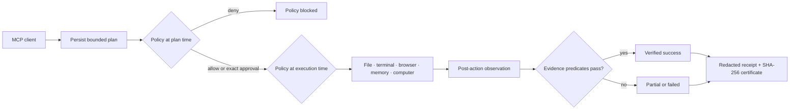

<p align="center">
  
</p>

<h1 align="center">ATLAS MCP</h1>

<p align="center">
  <strong>Safe execution. Durable memory. Verified outcomes.</strong>
</p>

<p align="center">
  An open-source Model Context Protocol runtime for files, terminal, browser,
  memory, and computer use—with policy checks, bounded execution, and evidence
  for every result.
</p>

<p align="center">
  <a href="https://github.com/XAGI-Lab/atlas-mcp/actions/workflows/ci.yml"></a>
  <a href="https://github.com/XAGI-Lab/atlas-mcp/actions/workflows/codeql.yml"></a>
  <a href="https://github.com/XAGI-Lab/atlas-mcp/releases"></a>
  <a href="LICENSE"></a>
  
  
  <a href="https://github.com/XAGI-Lab/atlas-mcp/discussions"></a>
</p>

<p align="center">
  
</p>

> [!WARNING]
> ATLAS MCP is an alpha release. Its local stdio runtime is tested end to end,
> but APIs may change before `1.0`. Use an isolated workspace, keep domain and
> command allowlists narrow, and review every consequential approval.

## One runtime, five execution layers 🧭

ATLAS MCP turns a tool call into a durable, inspectable task:

| Layer | What is implemented |
|---|---|
| 🗂️ **Files** | Root-confined read, hash, atomic write, move, mkdir, and delete with symlink-escape defenses |
| 💻 **Terminal** | Shell-free foreground and supervised background processes with allowlists, timeouts, cancellation, and redaction |
| 🌐 **Browser** | Isolated Playwright sessions, semantic DOM targets, bounded artifacts, network policy, and condition-based post-action settling |
| 🧠 **Memory** | Scoped SQLite memory with hybrid lexical ranking, confidence, freshness, diversity, expiry, supersession, provenance, and redaction |
| 🖥️ **Computer** | Capability discovery plus governed screenshot, pointer, keyboard, and scroll adapters on macOS and supported Linux/X11 setups |

Every layer passes through the same policy, approval, budget, verification,
receipt, and certificate pipeline.

## Evidence, not leaderboard theatre 📊

The numbers below come from committed scripts and JSON artifacts on an Apple
Silicon Mac. They are component measurements, not a claim that ATLAS MCP is
universally “the best” or that unlike benchmarks are directly comparable.

| Capability | Current public result | What it means |
|---|---:|---|
| 🧠 LoCoMo retrieval | **0.6291 mean evidence coverage @20** | 1,982 evidence-bearing questions; dialogue-turn ingest; zero model, embedding, or network calls |
| 🧠 Synthetic recall | **100/100 Recall@1** | Deterministic planted-fact regression over 1,000 records |
| 🌐 Static-page settle | **183.7 ms p50 vs 301.3 ms** | 39% less waiting with identical 10/10 correct reads |
| 🌐 Slow-render settle | **10/10 vs 0/10 correct** | Condition-based waiting observes the final DOM; fixed 300 ms reads too early |
| 💻 Terminal | **30/30 verified executions** | Shell-free process launch; 48.1 ms p50 on the measured machine |
| 🖥️ Computer control plane | **30/30 capability probes** | 0.032 ms p50 adapter discovery; this is not a desktop task-success score |
| ✅ Safety/execution evals | **22/22 passing** | Deterministic policy, traversal, terminal, memory, computer, cancellation, and verification scenarios |

Read the [research index](docs/research/README.md), the
[benchmark methodology](docs/research/METHODOLOGY.md), and the raw
[microbenchmark](docs/research/results/core-microbenchmarks.json) and
[LoCoMo](docs/research/results/locomo-retrieval.json) artifacts.

> [!IMPORTANT]
> ATLAS MCP has **not** run an official OSWorld, OSWorld-MCP, WebArena, or
> LongMemEval end-to-end submission. Those scores remain unclaimed until the
> exact public harness, environment, model policy, and evaluator are released
> with the result.

## A deliberately small MCP surface ✨

| MCP tool | Purpose |
|---|---|
| `atlas_capabilities` | Discover operations, platform support, limits, and policy posture |
| `atlas_plan` | Validate, persist, and policy-check one bounded operation |
| `atlas_execute` | Execute an approved plan and verify the declared outcome |
| `atlas_task_status` | Read durable task state |
| `atlas_task_cancel` | Cooperatively cancel pending or running work |
| `atlas_receipt` | Retrieve redacted evidence and the execution certificate |

High-level tools keep schemas compact while the operation contract carries the
specific file, terminal, browser, memory, computer, or system action.

## Quickstart 🚀

Requirements: Node.js 22 or newer, pnpm 9.5, and optionally Chrome, Chromium,
or Edge for browser work.

```bash
git clone https://github.com/XAGI-Lab/atlas-mcp.git
cd atlas-mcp
corepack enable
pnpm install --frozen-lockfile
pnpm build
pnpm atlas doctor
pnpm atlas init --client generic
```

Start the stdio server:

```bash
pnpm atlas serve
```

Run a read-only system task:

```bash
pnpm atlas run --request examples/01-system-info/task.json
```

Run a verified mutation:

```bash
pnpm atlas run --request examples/02-verified-file-write/task.json
```

Mutations pause for an exact, expiring, task-scoped approval phrase. See
[installation and client setup](docs/INSTALLATION.md) for Claude Desktop,
Cursor, VS Code, generic clients, Python, and Docker.

## Example: inspect computer-use support 🖥️

Computer input is never silently assumed. Discover the adapter first:

```json
{
  "goal": "Inspect local computer-use support",
  "operation": {
    "kind": "computer",
    "action": "capabilities"
  }
}
```

Screenshots are read-only. Pointer, typing, key, and scroll actions are
high-risk mutations: they require declared evidence and a scoped approval.
macOS also requires Screen Recording or Accessibility permission for the
corresponding action. Linux input currently requires `xdotool` and X11.

## How execution works ⚙️



```text
planned → awaiting_approval → running → verifying
                                     ↘ verified_success
                                     ↘ partial | failed | cancelled | budget_exhausted
```

A successful process or click is not automatically a successful goal. If a
mutation succeeds but its required evidence is missing or false, the task is
`partial`, never `verified_success`.

## Safe defaults 🔒

- Local-only stdio transport; no account or hosted service is required.
- Telemetry is off.
- Shell interpreters, privilege escalation, and arbitrary desktop key names
  are denied.
- Paths and terminal working directories remain inside the configured root.
- Browser domains start deny-by-default; private, link-local, loopback, and
  cloud-metadata destinations stay blocked unless explicitly permitted.
- Browser output is marked untrusted; page content never changes policy.
- Mutations require both declared evidence and exact task-scoped approval.
- Raw secret patterns are redacted before terminal output, memory, tasks, or
  receipts are persisted.
- Computer actions use bounded typed fields and platform adapters—not a
  user-supplied shell command.

See the [threat model](docs/THREAT_MODEL.md) and
[security policy](SECURITY.md) for residual risks.

## Reproduce the scores 🧪

```bash
# full validation
pnpm check
pnpm evals
pnpm e2e
pnpm pack:check
pnpm security:audit

# local memory, browser, terminal, and computer microbenchmarks
pnpm benchmark:core

# official LoCoMo data is intentionally not vendored (CC BY-NC 4.0)
git clone https://github.com/snap-research/locomo.git /tmp/locomo
pnpm benchmark:locomo -- \
  --dataset /tmp/locomo/data/locomo10.json \
  --output docs/research/results/locomo-retrieval.json
```

Benchmark artifacts include dataset hashes, environment details, sample
counts, latency percentiles, and claim boundaries.

## SDKs and implementation languages 🧩

- [`@atlas-mcp/sdk`](packages/sdk-ts) — TypeScript client.
- [`atlas-mcp`](sdk-py) — Python client.
- [`@atlas-mcp/protocol`](packages/protocol) and
  [`@atlas-mcp/receipt-schema`](packages/receipt-schema) — language-neutral
  JSON contracts.

ATLAS MCP is capability-driven, not language-restricted. Rust, Go, Python,
TypeScript, Swift, C#, or another language can be used when measurement shows
a real improvement in isolation, portability, performance, reliability, or
platform integration without fragmenting the public contracts.

## Repository map 🗂️

```text
apps/cli/                   CLI and stdio entrypoint
packages/protocol/          strict task and operation schemas
packages/runtime-core/      lifecycle, budgets, retries, cancellation
packages/policy-core/       local policy and scoped approvals
packages/server/            six-tool MCP server and runtime router
packages/file-runtime/      confined filesystem operations
packages/terminal-runtime/  shell-free process supervision
packages/browser-runtime/   isolated browser automation and stable-DOM wait
packages/computer-runtime/  governed local computer-use adapters
packages/memory/            scoped hybrid retrieval and lifecycle controls
packages/storage-sqlite/    durable local state
packages/verifier-core/     deterministic evidence predicates
packages/receipt-schema/    receipts and execution certificates
packages/sdk-ts/            TypeScript client SDK
sdk-py/                     Python client SDK
evals/                      deterministic evaluation harness
scripts/                    benchmark and release checks
docs/research/              methods, findings, and raw results
examples/                   runnable task examples
```

## Documentation 📚

- [Installation and client setup](docs/INSTALLATION.md)
- [Capabilities and limits](docs/CAPABILITIES.md)
- [Architecture](docs/ARCHITECTURE.md)
- [Research and benchmarks](docs/research/README.md)
- [Compatibility policy](docs/COMPATIBILITY.md)
- [Validation evidence](docs/VALIDATION.md)
- [Threat model](docs/THREAT_MODEL.md)
- [Roadmap](ROADMAP.md)

## Contributing 🤝

Code, adapters, benchmark harnesses, verifier predicates, documentation, and
threat analysis are welcome. Start with [CONTRIBUTING.md](CONTRIBUTING.md),
sign commits under the DCO, and report vulnerabilities through
[GitHub private vulnerability reporting](https://github.com/XAGI-Lab/atlas-mcp/security/advisories/new).

## License 📄

Software and documentation are licensed under the
[Apache License 2.0](LICENSE). The official logo and hero artwork are licensed
under [CC BY-ND 4.0](LICENSES/CC-BY-ND-4.0.txt); see
[BRAND.md](BRAND.md). Third-party benchmark datasets retain their own licenses
and are not included in this repository.

<p align="center">
  Built in the open by <a href="https://github.com/XAGI-Lab">XAGI Labs</a>.
</p>
