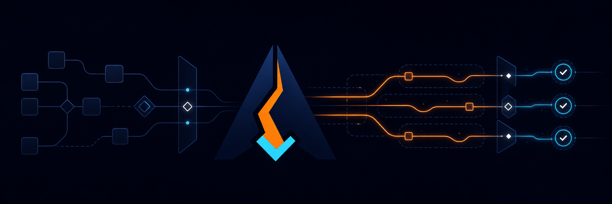
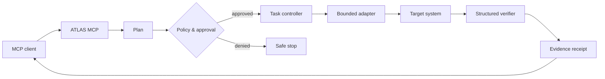

<p align="center">
  
</p>

<h1 align="center">ATLAS MCP</h1>

<p align="center">
  <strong>Safe, reliable, and verifiable execution for the Model Context Protocol.</strong>
</p>

<p align="center">
  Plan tasks, control capabilities, approve side effects, verify outcomes, and
  produce evidence—not just tool-call logs.
</p>

<p align="center">
  <a href="https://github.com/XAGI-Lab/atlas-mcp/actions/workflows/ci.yml">
    
  </a>
  <a href="https://github.com/XAGI-Lab/atlas-mcp/security/code-scanning">
    
  </a>
  <a href="LICENSE">
    
  </a>
  
  
  <a href="https://github.com/XAGI-Lab/atlas-mcp/discussions">
    
  </a>
</p>

<p align="center">
  
</p>

> [!IMPORTANT]
> ATLAS MCP is in early development. The execution core and documentation are
> available for review and contribution, but the first installable release has
> not shipped yet.

## Why ATLAS MCP? 🧭

MCP makes tools available to models. Real work needs more than availability.

A tool can return successfully while the user’s goal still fails: the wrong
target was changed, an operation never completed, or the model repeated the
same broken action. ATLAS MCP turns tool calls into governed tasks with
inspectable outcomes.

| Ordinary tool execution | ATLAS MCP execution |
|---|---|
| Call a tool | Plan a bounded task |
| Trust generated arguments | Validate declared capabilities |
| Execute side effects immediately | Request explicit approval |
| Retry until something changes | Detect repeated failures and stop loops |
| Treat a response as success | Verify against an expected outcome |
| Keep raw logs | Produce a redacted evidence receipt |

## Core capabilities ✨

### 🛡️ Governed execution

Every adapter declares what it can read, write, execute, and access over the
network. Consequential capabilities pass through policy and approval gates.

### ✅ Verify before done

A mutation invalidates earlier proof. ATLAS MCP requires a structured check
against an explicit expectation before reporting completion.

### 🧾 Evidence receipts

Tasks produce inspectable records with timestamps, hashes, tool versions,
verification results, and redacted artifacts.

### 🔁 Resilient tasks

Canonical retry keys, loop protection, timeouts, cancellation, and circuit
breakers keep failures bounded and explainable.

### 🧩 MCP-native

The runtime exposes a compact MCP contract instead of flooding clients with an
unbounded collection of low-level tools.

### 🔒 Local-first privacy

Local operation requires no account. Telemetry is off by default, and local
task data remains local unless the user deliberately configures an integration.

## How it works ⚙️



The planned MCP surface is deliberately small:

| Tool | Purpose |
|---|---|
| `atlas_capabilities` | Show available adapters, permissions, and execution modes |
| `atlas_plan` | Produce an inspectable plan without executing it |
| `atlas_execute` | Start an approved task |
| `atlas_task_status` | Inspect progress, state, and pending approval |
| `atlas_task_cancel` | Cooperatively cancel a running task |
| `atlas_receipt` | Retrieve evidence and verification results |

## Task lifecycle 🚦

```text
draft
  → planned
  → awaiting_approval
  → running
  → verifying
  → succeeded | failed | cancelled
```

Every transition is persisted and attributable.

## What exists today 🧪

- [x] Canonical retry and loop protection
- [x] Verify-after-mutation gate
- [x] Strict TypeScript configuration
- [x] Unit tests for execution-safety primitives
- [x] Linux, macOS, and Windows CI configuration
- [x] CodeQL, dependency review, Dependabot, and secret protection
- [x] Governance, security policy, threat model, and architecture decisions
- [ ] Capability and approval packages
- [ ] Durable task state and evidence receipts
- [ ] MCP protocol server and local adapters
- [ ] Conformance, safety, and end-to-end evaluation suites
- [ ] Signed installable release

Follow the complete [roadmap](ROADMAP.md) and
[validation record](docs/VALIDATION.md).

## Repository layout 🗂️

```text
atlas-mcp/
├── packages/
│   └── core/                 # execution safety primitives
├── docs/
│   ├── ARCHITECTURE.md
│   ├── PRODUCT_SCOPE.md
│   ├── THREAT_MODEL.md
│   ├── VALIDATION.md
│   ├── assets/
│   └── decisions/
├── .github/
│   ├── workflows/
│   └── ISSUE_TEMPLATE/
├── CONTRIBUTING.md
├── GOVERNANCE.md
├── ROADMAP.md
└── SECURITY.md
```

## Development quickstart 🚀

Requirements:

- Node.js 22 or newer
- pnpm 9.5

```bash
git clone https://github.com/XAGI-Lab/atlas-mcp.git
cd atlas-mcp
pnpm install
pnpm check
```

Current validation:

```text
TypeScript typecheck  ✓
Core tests           12 passed
```

## Design principles 📐

- **Evidence over claims** — completion is supported by inspectable proof.
- **Read-only first** — mutation is deliberate and policy-controlled.
- **Explicit approval** — consequential actions wait for user consent.
- **Privacy by default** — telemetry is off unless explicitly enabled.
- **Bounded failure** — retries, time, scope, and resources have limits.
- **Vendor-neutral** — core contracts do not depend on a cloud or model.
- **Small protocol surface** — stable task tools over low-level tool sprawl.

## Documentation 📚

- [Product scope](docs/PRODUCT_SCOPE.md)
- [Architecture](docs/ARCHITECTURE.md)
- [Threat model](docs/THREAT_MODEL.md)
- [Validation](docs/VALIDATION.md)
- [Roadmap](ROADMAP.md)
- [Governance](GOVERNANCE.md)
- [Security policy](SECURITY.md)

## Contributing 🤝

Contributions to code, tests, adapters, verification strategies,
documentation, and threat analysis are welcome.

1. Read [CONTRIBUTING.md](CONTRIBUTING.md).
2. Search [issues](https://github.com/XAGI-Lab/atlas-mcp/issues) and
   [discussions](https://github.com/XAGI-Lab/atlas-mcp/discussions).
3. Open a focused issue or design discussion.
4. Submit a signed-off pull request with tests and documentation.

Please report vulnerabilities through
[GitHub private vulnerability reporting](https://github.com/XAGI-Lab/atlas-mcp/security/advisories/new),
not a public issue.

## License 📄

The software and documentation are licensed under the
[Apache License 2.0](LICENSE).

The official logo and hero artwork are licensed under
[CC BY-ND 4.0](LICENSES/CC-BY-ND-4.0.txt). See the
[brand guidelines](BRAND.md) for attribution and permitted use.

<p align="center">
  Built in the open by <a href="https://github.com/XAGI-Lab">XAGI Labs</a>.
</p>
