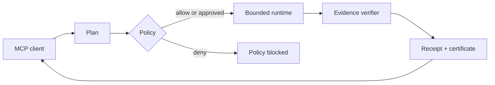

<p align="center">
  
</p>

<h1 align="center">ATLAS MCP</h1>

<p align="center">
  <strong>Safe, reliable, and verifiable execution for the Model Context Protocol.</strong>
</p>

<p align="center">
  Plan bounded tasks, control side effects, verify outcomes, and receive evidence—not just tool-call logs.
</p>

<p align="center">
  <a href="https://github.com/XAGI-Lab/atlas-mcp/actions/workflows/ci.yml"></a>
  <a href="https://github.com/XAGI-Lab/atlas-mcp/actions/workflows/codeql.yml"></a>
  <a href="LICENSE"></a>
  
  
  <a href="https://github.com/XAGI-Lab/atlas-mcp/discussions"></a>
</p>

<p align="center">
  
</p>

> [!WARNING]
> `0.1.0-alpha.0` is an engineering preview. The local stdio runtime works and is
> tested end to end, but its schemas and package layout may change before `1.0`.
> Review every approval request and use an isolated workspace for untrusted tasks.

## Why ATLAS MCP? 🧭

An MCP tool can return successfully while the user’s goal still fails. ATLAS
MCP treats execution as a durable task:

| Ordinary tool execution | ATLAS MCP |
|---|---|
| Call a tool immediately | Plan and persist a bounded task |
| Trust generated arguments | Validate strict versioned schemas |
| Run side effects silently | Require a scoped approval challenge |
| Retry without a stopping rule | Bound retries, time, and cancellation |
| Treat a response as success | Verify explicit evidence predicates |
| Keep opaque logs | Produce redacted receipts and a certificate |

## Working capabilities ✨

- 🗂️ **Files** — confined list, read, stat, hash, atomic write, move, mkdir,
  and delete operations with symlink-escape protection.
- 💻 **Terminal** — shell-free foreground and supervised background processes,
  command allowlists, environment filtering, timeouts, cancellation, and
  redacted output.
- 🌐 **Browser** — isolated Playwright sessions using installed Chrome,
  Chromium, or Edge; typed DOM actions; screenshots, uploads, downloads, and
  SSRF defenses and repeated DNS-address checks.
- 🧠 **Memory** — scoped local SQLite memory with provenance, confidence,
  secret redaction, search, listing, deletion, and reset controls.
- 🛡️ **Policy** — allow, deny, and confirm decisions re-evaluated immediately
  before execution.
- ✅ **Verification** — result, file, terminal, URL, and page predicates backed
  by receipts and SHA-256 execution certificates.

The MCP surface stays deliberately small:

| Tool | Purpose |
|---|---|
| `atlas_capabilities` | Discover operations, limits, and policy posture |
| `atlas_plan` | Validate, persist, and policy-check one operation |
| `atlas_execute` | Execute an approved plan and verify its outcome |
| `atlas_task_status` | Read durable task state |
| `atlas_task_cancel` | Cooperatively cancel pending or running work |
| `atlas_receipt` | Retrieve receipts, evidence, and the certificate |

## Quickstart 🚀

Requirements: Node.js 22 or newer, pnpm 9.5, and optionally a locally installed
Chrome, Chromium, or Edge browser.

```bash
git clone https://github.com/XAGI-Lab/atlas-mcp.git
cd atlas-mcp
corepack enable
pnpm install --frozen-lockfile
pnpm build
pnpm atlas doctor
pnpm atlas init --client generic
```

Start the stdio server:

```bash
pnpm atlas serve
```

Run a task directly:

```bash
pnpm atlas run --request examples/01-system-info/task.json
```

Mutations pause for an exact, task-scoped approval phrase:

```bash
pnpm atlas run --request examples/02-verified-file-write/task.json
```

See [installation and client setup](docs/INSTALLATION.md) for Claude Desktop,
Cursor, VS Code, generic clients, and Docker.

## Docker 🐳

```bash
docker build -t atlas-mcp:local .
docker run --rm atlas-mcp:local doctor
docker compose run --rm atlas-mcp
```

The Compose profile is read-only except for the mounted workspace, local data
volume, and bounded temporary filesystem. It drops Linux capabilities and sets
`no-new-privileges`.

## How execution works ⚙️



Task status is persisted in local SQLite:

```text
planned → awaiting_approval → running → verifying
                                     ↘ verified_success
                                     ↘ partial | failed | cancelled | budget_exhausted
```

ATLAS MCP never upgrades an unverified mutation to success. A successful action
with failed or missing required evidence is `partial`.

## Safe defaults 🔒

- Local-only stdio transport; no account or hosted service is required.
- Telemetry is off.
- Shell interpreters and privilege-escalation commands are denied.
- File paths and working directories are confined to the configured workspace.
- Browser domains start deny-by-default; private, link-local, loopback, and
  cloud-metadata targets remain blocked unless localhost is explicitly allowed.
- Mutations require both declared evidence and exact scoped approval.
- Raw secrets are redacted before terminal output or memory is persisted.

Security boundaries and known residual risks are documented in the
[threat model](docs/THREAT_MODEL.md) and [security policy](SECURITY.md).

## SDKs and language policy 🧩

- [`@atlas-mcp/sdk`](packages/sdk-ts) — TypeScript client.
- [`atlas-mcp`](sdk-py) — Python client.
- [`@atlas-mcp/protocol`](packages/protocol) and
  [`@atlas-mcp/receipt-schema`](packages/receipt-schema) — language-neutral JSON
  contracts implemented in TypeScript.

The project is capability-driven, not language-restricted. New components may
use Rust, Go, Python, TypeScript, or another suitable language when that choice
measurably improves isolation, portability, performance, reliability, or
platform integration without fragmenting the public contracts.

## Validation 🧪

```bash
pnpm check
pnpm evals
pnpm e2e
pnpm pack:check
pnpm security:audit
```

The suite includes unit tests, 21 deterministic evaluation scenarios, real
official-SDK stdio sessions, Python-SDK interoperability, a real installed
browser fixture, and a hardened-container smoke test. The exact evidence and
remaining platform/client gates are in [docs/VALIDATION.md](docs/VALIDATION.md).

## Repository map 🗂️

```text
apps/cli/                 CLI and stdio entrypoint
packages/protocol/        MCP request and task schemas
packages/runtime-core/    task lifecycle, budgets, retries, cancellation
packages/policy-core/     local policy and scoped approvals
packages/server/          six-tool MCP server and runtime router
packages/file-runtime/    confined filesystem operations
packages/terminal-runtime shell-free process supervision
packages/browser-runtime/ isolated browser automation
packages/memory/          scoped memory API and redaction
packages/storage-sqlite/  durable local state
packages/verifier-core/   deterministic evidence predicates
packages/receipt-schema/  receipts and execution certificates
packages/sdk-ts/          TypeScript client SDK
sdk-py/                   Python client SDK
evals/                    deterministic evaluation harness
examples/                 runnable task examples
```

## Documentation 📚

- [Installation and client setup](docs/INSTALLATION.md)
- [Capabilities and limits](docs/CAPABILITIES.md)
- [Architecture](docs/ARCHITECTURE.md)
- [Compatibility policy](docs/COMPATIBILITY.md)
- [Release process](docs/RELEASES.md)
- [Validation evidence](docs/VALIDATION.md)
- [Threat model](docs/THREAT_MODEL.md)
- [Roadmap](ROADMAP.md)

## Contributing 🤝

Code, documentation, tests, adapters, verifier predicates, and threat analysis
are welcome. Start with [CONTRIBUTING.md](CONTRIBUTING.md), sign commits under
the DCO, and report vulnerabilities through
[GitHub private vulnerability reporting](https://github.com/XAGI-Lab/atlas-mcp/security/advisories/new).

## License 📄

Software and documentation are licensed under the
[Apache License 2.0](LICENSE). The official logo and hero artwork are licensed
under [CC BY-ND 4.0](LICENSES/CC-BY-ND-4.0.txt); see
[BRAND.md](BRAND.md).

<p align="center">
  Made in the open by <a href="https://github.com/XAGI-Lab">XAGI Labs</a>.
</p>
