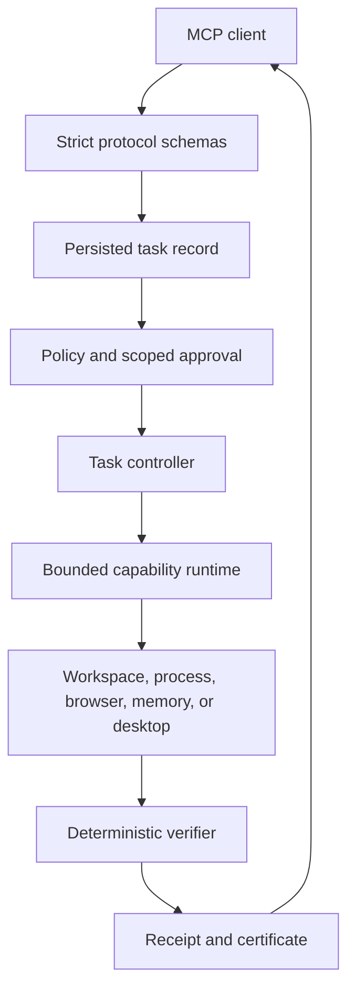

# Architecture

## Execution pipeline



Planning never executes. Execution re-evaluates policy so a plan cannot bypass
a policy change made after it was created. In the current alpha, the task
record is persisted but its executable payload remains process-local; execution
after a restart is not yet supported.

## Public contracts

The server exposes six high-level MCP tools. One task contains one typed
operation. Clients can compose longer workflows while every operation keeps its
own policy decision, approval, receipt, and certificate.

Protocol requests use strict Zod schemas. Receipts and certificates are
canonical JSON with SHA-256 identifiers so SDKs in other languages can
implement the same contract.

## Packages

| Package | Responsibility |
|---|---|
| `@melra/protocol` | MCP inputs, operations, task states, budgets, approvals |
| `@melra/runtime-core` | state transitions, retries, cancellation, budgets |
| `@melra/policy-core` | allow/deny/confirm policy and approval validation |
| `@melra/server` | MCP stdio transport and runtime routing |
| `@melra/file-runtime` | root-confined filesystem operations |
| `@melra/terminal-runtime` | shell-free process and background-job control |
| `@melra/browser-runtime` | isolated Playwright browser session |
| `@melra/computer-runtime` | typed local computer-use adapters |
| `@melra/memory` | scoped episode-aware hybrid retrieval, lifecycle, and redaction |
| `@melra/storage-sqlite` | tasks, receipts, certificates, and memory |
| `@melra/verifier-core` | deterministic evidence evaluation |
| `@melra/receipt-schema` | canonical receipts and certificates |
| `@melra/sdk` | TypeScript client |

The Python SDK consumes the same MCP and JSON contracts.

## Task state

```text
planned
  ├─ policy_blocked
  ├─ awaiting_approval
  └─ running
       ├─ cancelled
       ├─ budget_exhausted
       ├─ failed
       └─ verifying
            ├─ verified_success
            └─ partial
```

Read-only failures may retry within the task budget. Mutations and destructive
operations are never automatically retried. Cancellation is cooperative and
the task timer remains authoritative even when an adapter returns a generic
abort error.

## Trust boundaries

- Protocol schemas reject unknown or malformed fields.
- Policy classifies an operation before it reaches an adapter.
- Filesystem and terminal working directories are independently confined.
- Browser navigation is checked before launch and again for every request.
- Computer input is typed, platform-adapted, and classified as high-risk.
- Filesystem predicates independently re-read state. Result, terminal, URL, and
  page predicates currently evaluate adapter-returned observations.
- Evidence expectations are currently caller-authored. Connector-owned
  predicates and operation-to-subject binding remain required before evidence
  can be treated as independent outcome proof.
- Raw output is returned only to the live caller. Storage persists redacted
  task inputs and output; it is not a secret vault.
- Stdio is the only supported transport in `0.1`.

See [THREAT_MODEL.md](THREAT_MODEL.md) for detailed threats and mitigations.

## Language policy

The protocol, receipt, and policy formats remain language-neutral. A component
may use another implementation language when benchmarks or platform constraints
show a concrete benefit. Cross-language additions must preserve:

- deterministic JSON contracts;
- reproducible builds and an auditable dependency graph;
- supported-platform packaging;
- the same policy and verification behavior;
- end-to-end interoperability tests.
