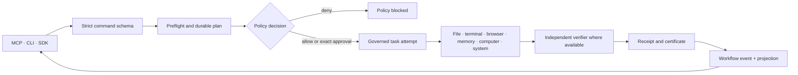

# Architecture

MELRA is a local-first execution system. MCP, CLI, and SDK callers use the
same task and workflow services; no interface bypasses schema validation,
policy, approval, budgets, verification, or durable evidence.

## Execution boundaries



A command requests a transition. Accepted workflow transitions append events
and update the current projection in one `BEGIN IMMEDIATE` SQLite transaction.
Events are the ordered facts; the projection serves status reads; snapshots
accelerate replay at checkpoints but do not replace event history.

Planning never executes an adapter. Task execution re-evaluates policy and
revalidates an approval against the current action digest immediately before
the effect.

## Durable storage

MELRA uses `<MELRA_HOME>/melra.sqlite` in WAL mode. Schema migration version
`1` adds the durable workflow and payload tables.

| Table | Authority |
|---|---|
| `schema_migrations` | Applied durable-schema versions |
| `tasks` | Redacted task projections |
| `task_payloads` | Encrypted exact task requests and optional results |
| `receipts` | Redacted action evidence |
| `certificates` | One terminal execution certificate per task |
| `memories` | Scoped, redacted local memory |
| `workflow_definitions` | Redacted immutable workflow definitions |
| `workflow_payloads` | Encrypted exact workflow definitions by version |
| `workflow_runs` | Current workflow projections and state versions |
| `workflow_events` | Append-only aggregate events with unique sequence |
| `workflow_snapshots` | Validated checkpoint projections |
| `idempotency_commits` | Unique committed logical task attempts |

Workflow creation persists the redacted definition, encrypted definition,
initial projection, and first two events atomically. Later transitions use
compare-and-swap on `state_version`; stale writers fail with
`workflow_state_conflict`.

## Encrypted executable payloads

Exact task requests, task results, and workflow definitions are canonicalized
and sealed with AES-256-GCM. A random 96-bit IV is used for every envelope.
Authenticated additional data binds ciphertext to its task or workflow
identity, version, and purpose, preventing record substitution.

The 256-bit key comes from one of two sources:

- `MELRA_PAYLOAD_KEY`, encoded as canonical base64url; or
- `<MELRA_HOME>/payload.key`, created atomically with mode `0600` inside a
  mode-`0700` data directory.

On Unix, an existing key with group/other permissions is rejected. Symlinks
and non-regular key files are rejected. Losing or changing the key makes
existing payloads unreadable. MELRA does not escrow or recover keys.

Status, events, logs, receipts, and certificates contain redacted projections,
not executable plaintext. `MELRA_HOME` still contains sensitive encrypted
material and must not be committed or publicly synchronized.

## Workflow model

A definition is an immutable, versioned DAG with at most 500 nodes. Node IDs
are unique; dependencies must exist; self-dependencies and cycles are rejected
before persistence. Every nested task is capability- and policy-preflighted
before the workflow is accepted.

| Node | Implemented semantics and bounds |
|---|---|
| `operation` | One governed task request |
| `approval` | Plans the target operation and pauses for its exact scoped challenge |
| `condition` | Re-verifies a persisted source result, then executes at most 50 requests from the selected branch |
| `parallel` | Executes 2–20 independent branches concurrently, each with 1–50 sequential requests |
| `bounded_loop` | Executes 1–50 body requests for at most 100 iterations and may stop on a persisted predicate |
| `checkpoint` | Emits `workflow.checkpoint_saved` and stores a validated snapshot |
| `compensation` | Runs a governed compensating request after its verified target is followed by failure |

The total definition limit is 500 nodes; each node may declare at most 100
dependencies. A task budget allows at most 100 steps, 900 seconds, and 10 read
retries. Mutations are never automatically retried.

Human-input and delegation nodes are not implemented in this alpha.

## Workflow state and events

Workflow statuses are:

```text
draft → planned → running → verified_complete
                  ↘ awaiting_approval
                  ↘ recovery_required
                  ↘ failed
                  ↘ cancelled
```

The public schema reserves `paused`, `suspended`, and `partially_complete`,
but this slice does not expose commands that enter those states.

Implemented event types are:

- `workflow.created`;
- `workflow.status_changed`;
- `workflow.node_changed`;
- `workflow.checkpoint_saved`;
- `workflow.recovered`;
- `workflow.recovery_required`;
- `workflow.cancelled`.

Sequences start at one and increase without gaps per workflow. Event replay
rejects duplicate, missing, reordered, or corrupt history. A corrupt snapshot
may be ignored only when full event replay succeeds.

## Restart, uncertainty, and concurrency

At startup, task recovery runs before workflow recovery and before any public
interface is served.

- Planned and approval-waiting payloads remain executable after restart.
- Interrupted reads return to `planned` and may retry within their original
  budget and idempotency identity.
- A mutation in `verifying` may become `verified_success` only when all
  required predicates are independent filesystem observations
  (`file_exists`, `file_absent`, or `file_hash`).
- Other interrupted mutations enter `recovery_required`; MELRA does not repeat
  them automatically.
- A verified task committed before its workflow projection is repaired from
  persisted task evidence and recorded as `workflow.recovered`.
- Idempotency keys bind workflow, node, iteration, branch, and canonical
  request. SQLite rejects a second committed attempt.
- Competing advances for one workflow are serialized inside a server process.
  Concurrent independent branches remain parallel.

Multiple MELRA server processes may share one `MELRA_HOME`. Advancing a workflow
takes an expiring SQLite lease before any adapter runs, so a second process is
refused with `workflow_lease_held` rather than starting duplicate side effects.

## Public interfaces

The stdio MCP server exposes exactly eleven tools:

| Task tools | Workflow tools |
|---|---|
| `melra_capabilities` | `melra_workflow_plan` |
| `melra_plan` | `melra_workflow_advance` |
| `melra_execute` | `melra_workflow_status` |
| `melra_task_status` | `melra_workflow_cancel` |
| `melra_task_cancel` | `melra_workflow_control` |
| `melra_receipt` |  |

The CLI exposes `workflow plan`, `workflow advance`, `workflow inspect`,
`workflow cancel`, and the operator halts `workflow pause`, `workflow resume`,
and `workflow suspend`. The TypeScript and Python SDKs call the same workflow
tools and do not implement a second execution engine.

## Packages

| Package | Responsibility |
|---|---|
| `@melra/protocol` | Strict task, workflow, event, approval, and MCP contracts |
| `@melra/runtime-core` | Task execution, workflow transitions, recovery, and replay |
| `@melra/policy-core` | Allow/deny/confirm policy and approval validation |
| `@melra/server` | Runtime composition and MCP stdio transport |
| `@melra/storage-sqlite` | Transactional local authority |
| `@melra/file-runtime` | Root-confined filesystem operations |
| `@melra/terminal-runtime` | Shell-free process and background-job control |
| `@melra/browser-runtime` | Isolated Playwright browser execution |
| `@melra/computer-runtime` | Typed local computer-use adapters |
| `@melra/memory` | Scoped local retrieval, lifecycle, and redaction |
| `@melra/verifier-core` | Deterministic evidence evaluation |
| `@melra/receipt-schema` | Canonical receipts, certificates, hashes, and redaction |
| `@melra/sdk` | TypeScript MCP client |

## Verification boundary

Filesystem predicates independently re-read the workspace. Result, terminal,
URL, and page predicates currently evaluate adapter-returned observations.
Predicates are caller-authored, so a weak predicate can prove too little.
Models and adapters cannot approve actions or mark a workflow complete, but
MELRA is not yet an independent semantic judge of arbitrary goals.

See [THREAT_MODEL.md](THREAT_MODEL.md) and
[COMPATIBILITY.md](COMPATIBILITY.md) for residual risks and alpha guarantees.
