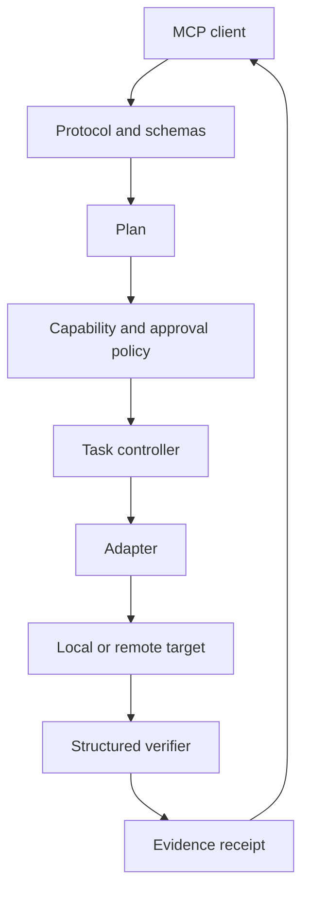

# Architecture

## Execution pipeline



## Components

| Component | Responsibility |
|---|---|
| Protocol | Stable MCP tools and versioned schemas |
| Controller | Task state, cancellation, retries, and timeouts |
| Policy | Capability decisions and approvals |
| Adapters | Bounded interaction with files, browsers, shells, and HTTP |
| Verifier | Checks outcomes against explicit expectations |
| Evidence | Redacted receipts, hashes, timestamps, and provenance |
| Storage | Local durable task and receipt state |
| Testkit | Conformance fixtures, fake adapters, and safety regressions |

## Planned packages

| Package | Responsibility |
|---|---|
| `@atlas-mcp/core` | Task state, retry, cancellation, and execution gates |
| `@atlas-mcp/protocol` | MCP schemas and versioned contracts |
| `@atlas-mcp/policy` | Capabilities and approval decisions |
| `@atlas-mcp/evidence` | Receipts, redaction, hashes, and provenance |
| `@atlas-mcp/verifier` | Deterministic verification interface |
| `@atlas-mcp/storage-sqlite` | Local durable state |
| `@atlas-mcp/adapters-local` | Local filesystem, browser, shell, and HTTP |
| `@atlas-mcp/testkit` | Conformance fixtures and fake adapters |

Package names remain provisional until the registry namespace is verified.

## Task state machine

```text
draft
  -> planned
  -> awaiting_approval
  -> running
  -> verifying
  -> succeeded | failed | cancelled
```

Every transition is persisted and attributable. A mutation invalidates previous
proof and requires a new structured verification.

## Dependency rule

The core contains no adapter, hosted-service, account, billing, or model-provider
dependency. Adapters depend on core contracts, never the reverse.
