# Representative Browser Benchmark Design

**Status:** approved direction; written specification awaiting review  
**Date:** 2026-07-28  
**Product:** MELRA

## Goal

Add a reproducible browser-agent evaluation that measures end-to-end task
success through MELRA, then use the non-headline development suite to
improve general browser reliability before running a registered final
evaluation.

The work must produce evidence that is useful to contributors without
presenting a selected subset as an official full-benchmark or cross-product
leaderboard score.

## Scope

This cycle delivers:

1. a full 125-task MiniWoB compatibility and development run through the
   official BrowserGym task environments and evaluators;
2. one pre-registered 30-task evaluation from the official
   WebArena-Verified Hard subset;
3. an MCP benchmark driver, immutable manifests, raw result schemas, aggregate
   reports, failure classifications, and reproduction documentation;
4. browser-runtime changes that are required for the benchmark and improve
   general task execution, but only when justified by MiniWoB or generic
   regression evidence;
5. README examples showing where MELRA can be used for coding, browser,
   terminal, computer-use, and memory workflows.

This cycle does not claim:

- a full 812-task WebArena-Verified score;
- a full 258-task WebArena-Verified Hard score;
- an official BrowserGym, WebArena, OSWorld, or OSWorld-MCP leaderboard rank;
- that one model's result isolates model quality from runtime quality;
- compatibility with a named MCP client until that released client has passed
  the documented compatibility gate.

OSWorld work remains a later phase because the current Apple Silicon host does
not provide the controlled VM setup required for a representative desktop
task run.

## Benchmark integrity

### Two suites with different purposes

MiniWoB is the development suite. All 125 tasks exposed by
`browsergym-miniwob==0.14.3` are included. It may be run repeatedly while
improving generic browser behavior. Its result is reported as an
official-environment compatibility score, not as evidence of broad real-world
web performance.

WebArena-Verified Hard-30 is the final evaluation suite. Its task manifest is
registered before implementation and must not change after task outcomes are
observed. No WebArena-Verified task trace may be used to tune the candidate
before its first paired baseline/candidate run.

### Pinned upstream inputs

The initial manifests pin:

- BrowserGym MiniWoB PyPI version: `0.14.3`
- BrowserGym source revision:
  `9e779f087de9a65668b6974d11f9ce9816026e96`
- WebArena-Verified PyPI version: `1.2.3`
- WebArena-Verified source revision:
  `6473f72db5dcefc97b5725b59e734504edc28a21`
- WebArena-Verified Hard task-data SHA-256:
  `4fccaef496870558a0c65ae97c7350c625b498688df87051afd254db7899a76f`
- WebArena-Verified Hard subset-manifest SHA-256:
  `3b0a4df231bb5a0c642215e521c3fa97701a384f52a734dc2db8f617ad0591a7`
- MELRA browser baseline:
  `a8a0a0907a7eed29249b94c89af3449efbcec4c3`
- CPython: `3.11`

Container images, browser versions, the candidate commit, the agent prompt,
and the model must be pinned by immutable identifier in the run manifest
before a score-producing run starts. A mutable image tag or model alias makes
the run non-publishable.

No model API calls, paid cloud resources, Docker cleanup, or deletion of local
images and volumes is authorized by this specification. Those actions require
separate, exact approval.

The baseline runtime requires the same benchmark-only CDP and HAR
instrumentation as the candidate. Its implementation identity therefore
contains both the pinned source commit above and an instrumentation commit
that changes connection/evidence capture only. That instrumentation commit is
frozen before MiniWoB-driven behavior improvements begin and is shared by both
sides. A test and diff audit must show that it does not change action
selection, targeting, policy, settling, or verification behavior.

### Registered WebArena-Verified Hard-30 subset

The subset is selected from the official 258-task Hard set with seed
`melra-webarena-verified-hard-30-v1`. Within each site-family and task-type
stratum, tasks are ordered by
`SHA-256("<seed>:<task_id>")`. Selection skips repeated
`intent_template_id` values so the 30 tasks represent 30 distinct templates.

| Site family | Mutate | Navigate | Retrieve | Total |
|---|---:|---:|---:|---:|
| GitLab | 4 | 1 | 2 | 7 |
| Reddit | 4 | 0 | 1 | 5 |
| Shopping | 2 | 1 | 3 | 6 |
| Shopping admin | 3 | 1 | 2 | 6 |
| Cross-site | 3 | 2 | 1 | 6 |
| **Total** | **16** | **5** | **9** | **30** |

Registered task IDs:

```text
15, 21, 67, 105, 113, 166, 172, 226, 268, 284,
430, 446, 528, 544, 556, 566, 577, 603, 638, 646,
658, 675, 701, 708, 733, 738, 780, 788, 795, 799
```

The implementation manifest must also store each task's sites, task type,
intent template ID, upstream revision, and selection seed. A test regenerates
the selection from the pinned upstream file and fails if any field drifts.

## Architecture

### Benchmark package

A focused Python package under `benchmarks/browser-agent/` owns benchmark
orchestration because BrowserGym and WebArena-Verified publish their supported
harnesses in Python. It uses the existing `MelraClient` from `sdk-py` to
exercise the real six-tool stdio server rather than importing runtime
internals.

The package has five bounded responsibilities:

1. **Manifest loader** — validates immutable upstream identities, registered
   tasks, model settings, prompt hash, container digests, and MELRA commits.
2. **Environment adapter** — starts or connects to the official task
   environment, resets it between tasks, and exposes its active page to the
   MELRA browser runtime.
3. **MCP driver** — translates each agent tool decision into
   `melra_plan`/`melra_execute`, handles exact scoped approvals supplied by the
   benchmark policy, and captures receipts.
4. **Evaluator adapter** — obtains MiniWoB rewards from BrowserGym and
   WebArena-Verified results from its deterministic response/network-trace
   evaluators.
5. **Reporter** — writes one append-only record per attempted task and creates
   a deterministic aggregate report from those records.

The harness may coordinate environments and agents. It may not execute browser
mutations outside MELRA.

### Shared browser control

BrowserGym must retain ownership of MiniWoB task setup and evaluation while
MELRA performs every browser action. A benchmark-only CDP connection
connects the Node browser runtime to the active Chromium instance. The
BrowserGym adapter calls its normal post-action observation and evaluator
after the MCP action. If a BrowserGym evaluator cannot observe an action
performed through the shared page, the task is an infrastructure error and
the suite is not publishable.

For WebArena-Verified, the official environment-control tooling resets and
health-checks site containers. MELRA owns the browser session and records
the network trace required by the official offline evaluator. Browser
recording is configured outside task input so an agent cannot disable or
redirect evidence capture.

The CDP and trace options are explicit runtime configuration. They do not
weaken the default isolated-browser mode used by ordinary installations.

### Agent boundary

The benchmark runner accepts one fixed agent configuration per paired run:

- provider and immutable model ID;
- temperature and sampling parameters;
- input and output token limits;
- system prompt SHA-256;
- exact tool-schema SHA-256;
- maximum 30 agent steps per WebArena task;
- maximum 10 agent steps per MiniWoB task;
- one attempt per task.

The same configuration is used for the baseline and candidate. The runner
records input, cached-input, reasoning, and output tokens when the provider
reports them. Missing token accounting is reported as unavailable, never
estimated.

The model chooses actions and the final response. MELRA remains
responsible for policy, approvals, execution, post-action observation,
verification, receipts, and bounded failures.

## Data flow

```mermaid
flowchart LR
    Manifest["Pinned run manifest"] --> Preflight["Hash, site, model, and commit preflight"]
    Preflight --> Environment["Official task environment"]
    Environment --> Observation["Task intent + current observation"]
    Observation --> Agent["Fixed agent configuration"]
    Agent --> Driver["MELRA stdio driver"]
    Driver --> Runtime["Policy + browser runtime"]
    Runtime --> Evidence["Observation + receipt + trace"]
    Evidence --> Agent
    Evidence --> Evaluator["Official evaluator"]
    Evaluator --> Record["Append-only task record"]
    Record --> Report["Deterministic aggregate report"]
```



Each task begins from an official reset. A run cannot silently reuse browser
state, cookies, memory, or approvals from the preceding task. The environment,
MELRA data directory, and receipt store are isolated by run and task.

## Metrics and score publication

### Primary metric

The primary WebArena-Verified metric is exact official evaluator task success:

```text
successful tasks / 30 registered tasks
```

The report includes the numerator, denominator, rate, and Wilson 95% confidence
interval. Headline copy must say “WebArena-Verified Hard-30 registered subset,”
never “WebArena score” or “WebArena rank.”

### Secondary metrics

The report also includes:

- success by task type and site family;
- baseline-to-candidate paired wins, losses, ties, and McNemar result;
- agent steps and MCP calls, with p50 and p95;
- input, cached-input, reasoning, and output tokens when available;
- wall-clock duration, with p50 and p95;
- approval count, policy-block count, retry count, and verification outcome;
- invalid action, schema rejection, timeout, evaluator, site, model, and
  infrastructure failure counts;
- receipt and sanitized-trace hashes.

MiniWoB reports success over all 125 tasks plus category-level results, action
counts, tokens, and latency. It stays separate from the Hard-30 result.

### Baseline and candidate

The baseline is built from the pinned `a8a0a09` source plus the shared,
benchmark-only instrumentation commit. The candidate is frozen only after:

1. the full MiniWoB development suite has run;
2. generic browser tests and project validation pass;
3. the candidate commit and all run inputs are written to the manifest.

The baseline and candidate then run the same registered Hard-30 tasks with the
same agent configuration. Task order is deterministically shuffled from the
run ID, and baseline/candidate order alternates by task to limit environmental
drift.

## Error handling and exclusions

Preflight fails before task execution when a hash, version, commit, container
digest, model identity, policy, site health check, browser connection, or
required evaluator is missing.

Every registered task produces one record. Agent errors, invalid actions,
policy blocks, timeouts, and unmet verification count as task failures; they
cannot be excluded.

An official environment can mark a task unachievable. Such a task remains in
the report with the official reason and is excluded only from a separately
labeled achievable-task denominator. The fixed 30-task denominator is always
shown.

Infrastructure failures are reported separately and make the paired run
non-publishable until the entire affected baseline/candidate pair is rerun
from a clean reset. The runner never retries only the losing side.

Interrupted runs can resume from append-only task records only when all pinned
inputs and the task's untouched pair state match exactly.

## Evidence, privacy, and public artifacts

Raw HAR files can contain headers, cookies, URL queries, form data, and typed
values. They are evaluated locally and are never committed. The reporter
publishes:

- the immutable manifest;
- per-task outcome, timing, token, and failure metadata;
- official evaluator output;
- redacted receipts;
- sanitized trace summaries and hashes;
- aggregate JSON and Markdown reports;
- exact reproduction commands and environment metadata.

Sanitization removes cookies, authorization headers, query values, form
payloads, typed text, filesystem paths, and common secret patterns. A
secret/path scan is a publication gate. Public artifacts contain only
benchmark fixtures and product evidence—no private project, account, user, or
internal-system information.

## Test strategy

Implementation follows red-green-refactor cycles. Required automated coverage
includes:

- manifest schema, hash pinning, exact task IDs, quota totals, and unique
  intent templates;
- regeneration of Hard-30 from the pinned upstream task file;
- task isolation and reset behavior;
- all agent actions traversing the real MCP client;
- approval scoping and failure-closed behavior;
- BrowserGym shared-page observation and reward on a deterministic MiniWoB
  fixture;
- WebArena evaluator invocation with a small checked-in synthetic trace
  fixture, not a copied benchmark task;
- append-only resume rules and baseline/candidate pairing;
- aggregate metrics, Wilson interval, percentiles, and McNemar counts;
- raw HAR exclusion, receipt/trace sanitization, and secret scanning;
- refusal to publish partial, mutable, or infrastructure-invalid runs.

The complete repository validation suite remains required before a benchmark
branch can merge.

## README product examples

The README gains a “Where you can use MELRA” section with short examples:

- **Coding clients:** inspect a repository, run a test, write a bounded fix,
  and verify the changed file.
- **Browser work:** navigate to an allowed site, inspect semantic elements,
  submit a form with approval, and verify the resulting page.
- **Terminal automation:** run builds or tests without a shell, supervise a
  bounded process, and keep redacted logs.
- **Computer use:** inspect support, take a screenshot, then perform an
  approved click or keyboard action on supported platforms.
- **Project memory:** store a scoped decision or procedure and retrieve it in a
  later task without a hosted account.

The section says that MELRA can be configured in stdio-capable MCP clients
and links to the compatibility matrix. It distinguishes “documented setup”
from “released-client verified” status and keeps examples within implemented
capabilities.

## Delivery sequence

1. Commit this specification and obtain written-spec review.
2. Write the implementation plan.
3. Add manifests, schemas, and deterministic report math test-first.
4. Add the shared-browser and official-evaluator adapters test-first.
5. Add the README usage examples and reproduction documentation.
6. Run local validation and the full MiniWoB development suite.
7. Freeze the candidate and request any exact infrastructure/model budget
   authorization needed for Hard-30.
8. Run the paired registered Hard-30 evaluation once, publish all allowed
   evidence, and update the scorecard with its precise claim boundary.
9. Commit, push, open a PR, wait for required checks, and merge the exact
   green head.

## Success criteria

This benchmark cycle succeeds only when:

- all 125 MiniWoB tasks and all 30 registered Hard tasks are accounted for;
- the baseline and candidate use identical pinned agent and environment inputs;
- every browser mutation passes through MELRA;
- official evaluators, not process exit codes or action success, determine task
  success;
- public artifacts reproduce the aggregate report and pass the privacy gate;
- the README contains accurate small examples across the five execution
  layers;
- the repository's full validation and required GitHub checks pass;
- published text uses the exact subset label and does not claim an official
  leaderboard rank.
